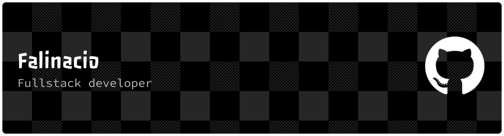

-----

<div>

</div>

-----

<div align="center">
<table>
<tr>
 <td align="center" colspan="11"></td>
</tr> 
<tr>

<td><a href="https://github.com/caiofalsantos" target="_blank"></a>
</td>
<td><a href="mailto:caiofalinacio@gmail.com" target="_blank"></a>
</td>
<td><a href="https://wa.me/5531995597489" target="_blank"></a>
</td>
<td><a href="https://www.instagram.com/caiofalinacio/" target="_blank"></a>
</td>
<td><a href="https://www.linkedin.com/in/caio-falinacio-464b18357" target="_blank"></a>
</td>

</tr>
<tr>
 <td align="center" colspan="11"></td>
</tr> 
</table>
</div>

<div align="justify">
<i><b>Oi</b> :wave:, sou o <code>Caio</code>, tenho 19 anos e faço Engenharia de Software na <a href="https://www.pucminas.br/" target="_blank">PUC Minas</a>.</i> 
<i><br><br>Aqui estão algumas das minhas estatísticas de codificação, via WakaTime:</i>
</div>
<br>
<!--START_SECTION:waka-->

```txt
From: 19 August 2025 - To: 06 January 2026

Total Time: 174 hrs 3 mins

Java              94 hrs 50 mins  █████████████▓░░░░░░░░░░░   54.49 %
Python            36 hrs 32 mins  █████▒░░░░░░░░░░░░░░░░░░░   20.99 %
JavaScript        18 hrs 50 mins  ██▓░░░░░░░░░░░░░░░░░░░░░░   10.83 %
HTML              8 hrs 12 mins   █▒░░░░░░░░░░░░░░░░░░░░░░░   04.72 %
CSS               6 hrs 36 mins   █░░░░░░░░░░░░░░░░░░░░░░░░   03.79 %
```

<!--END_SECTION:waka-->


